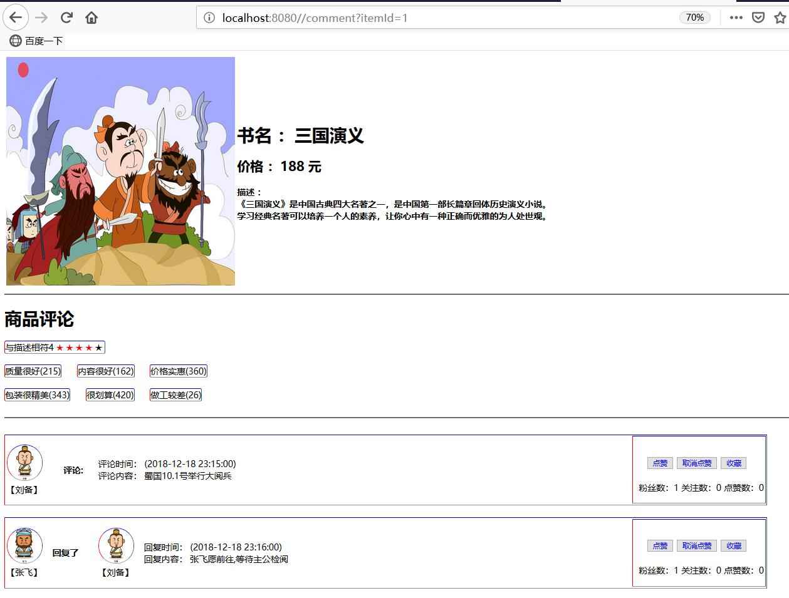

#评论功能

### 评论主题表、评论表、用户表
```
 评论主题表 和 评论表是 1 对 多关系 ：一个主题可以有多个评论
 
 用户表 和 评论主题表 是 多 对 多关系 ：一个用户可以评论多个主题，一个主题可以被多个用户评论
   
 评论表（其实就是一张用户表和评论主题的关联关系表，其中冗余了评论等相关信息，和id，pid设计用于实现无限层级查找子评论） 通过 递归调用 查询评论的所有回复
 
 
 
新增评论的SQL：
 
INSERT INTO t_comment(id,customer_id,parent_comment_id,	content_id,	type,content,comment_date,comment_time,state)
VALUES('17','3','16','1','1','张飞愿前往,等待主公检阅','2018-12-18','23:16:00','0');


```
  



# 点赞功能

点赞表：id, 点赞人用户id,被点赞的评论id,点赞的类型type

# 收藏功能

收藏表：id,收藏用户的id,收藏的商品id,收藏的类型type


京东的评论回复功能：

### 差评回复1:


### 差评回复2:


### 淘宝下架状态的商品


